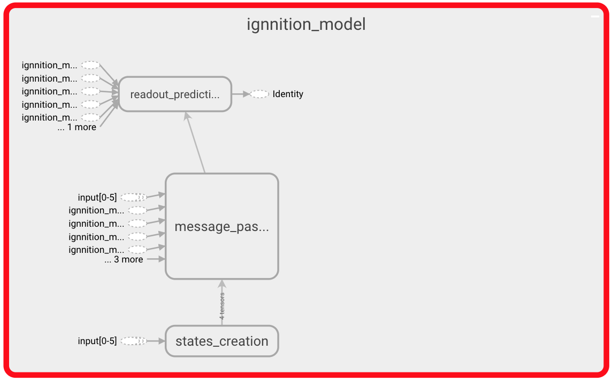
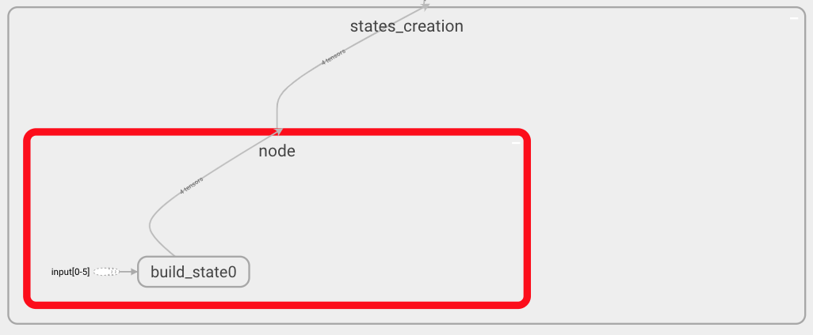
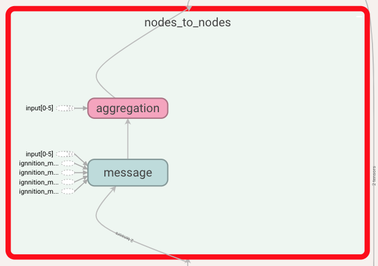
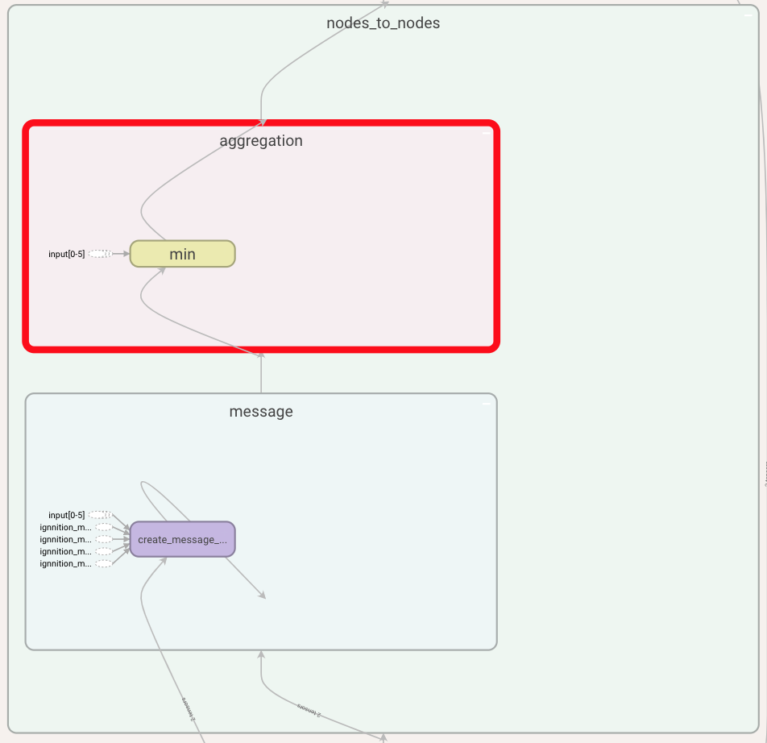
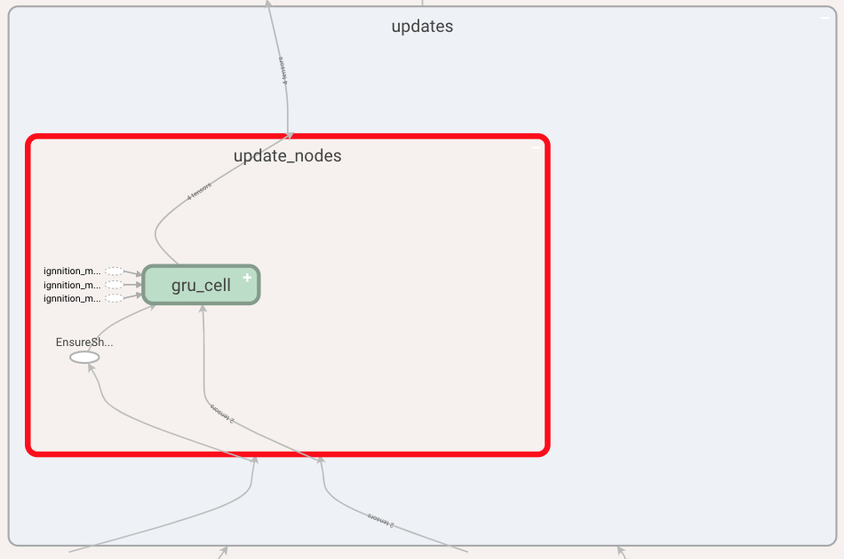
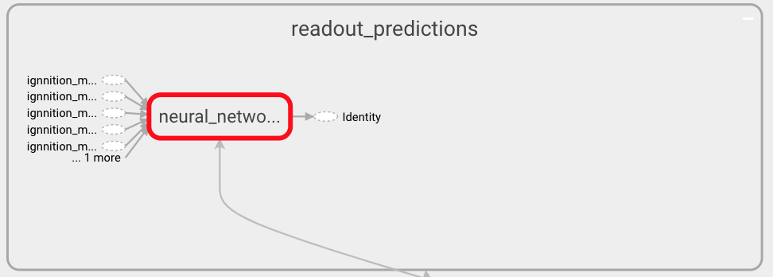
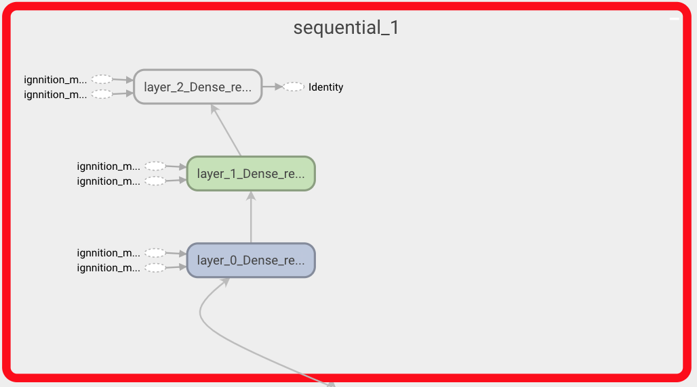
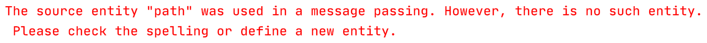
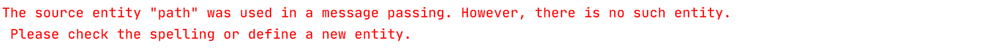

# Debugging assistant
Our debugging assistant is based on two different integrated systems. On the one hand, an extension of Tensorboard that allows a visualization of the architecture of the resulting *GNN*. Additionally, we provide an error-checking system that will help users solve any possible misconfiguration of the model.

## Tensorboard visualization
*IGNNITION* incorporates a visualization system to help user's debug their models. This system is based on an enriched visualization of Tensorboard. This visualization, hence, will show graphically the computational graph of the resulting model (containing all the operations). The most interesting part is that this visualization will be organized in very intuite jerarquies that will allow the user to check that the model is doing what it was expected to. Furthermore, the fact that this assistant is based on Tensorboard allows the users to modify the granularity of the visualization, to adjust to their specific need by double-clicking an specific box.

In order to optain this information, the user must run the *model.computational_graph()* as seen in [quick tutorial](quick_tutorial.md). Then, when placed in the model directory, simply run:
```
    tensorboard --logdir ./
```
Then, access through your web browser localhost://6006, which will show the graph.

### Visualization of Shortest-Path
In order to further understand the information that this system provides, we will use the very simple example of Shortest-Path, presented in [quick start tutorial](../quick_tutorial/#step-5-debugging).

First of all, once you are in the Tensorboard page, look for a box named *Ignnition_model*. If you expand this box, you should see the following:



In this image we can distinguish the three main phases of the *GNN*. First of all, the state creation which will create the state of each of the nodes. Then the message passing phase during which the messages are exchanged between neighboring nodes. Finally, we can observe the readout phase in charge of making the actual predictions. Let us expand a bit more on each of this phases of the algorithm.

#### State creation
First of all, let us focus on the state creation part. To do so, navigate through the  *state creation* box until reaching the state shown below.



In this case, you can observe that only one box within the state creation box is shown, since we have only defined one entity. Inside this box, we can see all the operations that define how these states are formed. In this very simple scenario, we only have one *build_state* operation. If more operations were defined, we would observe the corresponding pipeline.

#### Message passing
Now we may focus on the message passing phase. Again, navigate through the *Ignnition_model* box, where you will find a box for each of the iterations of the MP phase. Click on one indistinctively.


Above we show what a single iteration looks like. In it, we find all the stages (time-steps) forming this iteration. In our example, we only have one stage. Within the stage, we can see, on the one hand, all the message passings between entities, as their could be more than one entity sending to another. In our example we have that vertices of type node send their messages to the other nodes (i.e node_to_node). We can also find the update box, as the update is done at the very end of each of the stages, once all the simultanious message passing has taken place. If we now expand the *node_to_node* box, we see the following:



At this point we can observe the message creation function that nodes use to form their messages, and also the aggregation function. Let us take a look at these functions:



This representation shows the type of aggregation used and how the message function is computed. Note that you can get even more detail by further expanding each of this boxes.

Finally, let us take a look at the update function where we can see the update performed by each of the involved entities, in this case only the *node* entity. By further expanding this box we can see the type of layer used, this being a *gru*.



#### Readout
To finish this section, we can review the structure of the readout function defined to compute the predictions. For this, navigate by clicking over the readout box within the scope of *Ignnition_model*. Then, you will observe a pipeline of all the operations used for the definition of this function (the last one of which computes the final prediction). In this very simple scenario, and for sake of simplicity, we can only see one box as we only defined a *Neural_network* operation.



As always click on any box to obtain a finer-grained representation. For instance, by clicking over a *Neural network operation* we can observe the actual architecture of the Neural Network as shown below. There we can see the three layers that we defined for the readout network.




## Error checking
As mentioned in [generate your dataset](generate_your_dataset.md), our model is defined through the use of references to the actual value of the features, nodes... found in the dataset. Furthermore, throughout the definition of the model, we constantly reference to neural networks using its name. Then, the actual architecture of the Neural Network is defined seperately at the end of the document. 

*IGNNITION*, thus, requires that all this references are correct as well as to ensure that all the keywords used are correctly used. For this reason, we incorporate a system of error-checking in *IGNNITION*, which will automatically detect any malfunctioning and guide the user during the process of correcting such syntactic mistakes. Below we provide a couple of examples, for illustrative puporses of some common errors:

### Wrong Neural Network reference
A common mistake could be that we referenced in the readout a Neural Network that we did not define.

```yaml
readout:
    - type: feed_forward
        input: [path]
        nn_name: readout_nn_model
        output_label: delay
```

In this case, since there is no readout defined with the name *readout_nn_model*, the system would output the following message in the terminal:



### Wrong entity
Another common mistake is that we define a message passing between two entities, one of which is not defined (perhaps due to its spelling). In this case, we would get the following message:



