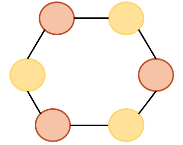
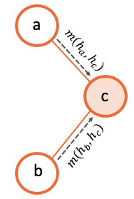
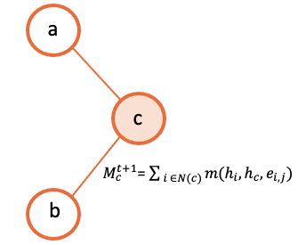
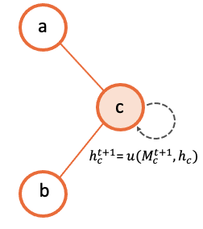
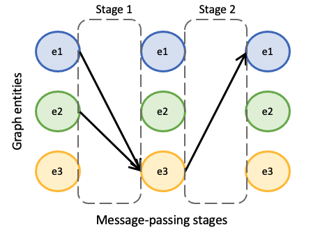

# Generate your GNN
In order to define the architecture of the GNN we aim to create, the user is asked to define a model_description.yml file. This file will contain several sections that will define different aspects of our GNN. More specifically, the sections we must filled are:<br>
1. [Entity definition](#step-1-entity-definition)<br>
2. [Message passing definition](#step-2-message-passing-definition)<br>
3. [Readout definition](#step-3-readout-definition)<br>
4. [Internal Neural Network definition](#step-4-internal-neural-networks-definition)

Let us now go a little bit in more detail into each of these sections.

## Step 1: Entity definition
When designing a GNN, we might find situations in which not all the nodes in the graph behave /represent the same object. For this, we might need to consider different behaviours depending on the type of node in question.
For this, we shall refer to an entity as a type of node in the graph.



From this example, we can observe that two entities must be created. Consequently, our model_description file must include a definition for each of them. Let us briefly describe how this can be done.

```yaml
- entity: entity1
  state_dimension: 32
  initial_state:
  - type: build_state
    input: [feature1, feature2]

- entity: entity2
  state_dimension: 32
  initial_state:
  - type: build_state
    input: [feature3]
```

In the code from above, we can see that we simply have to create a list of two entities (this will depend on the problem). Then, for each of the entities we first indicate its name, which we will use throughout the rest of the definition of the GNN to refer to these type of nodes. Additionally, we provide the dimension of the states that each of these nodes will have. Finally, we must indicate how the initial state is computed. For this definition, we must provide a list of "operations" which increasingly define the the resulting initial state. For simplicity, in these example, we simply define an initial state with *feature1* and *feature2*, and the rest of dimensions will be padded with 0s. Note that we do similarly with *entity2*.

## Step 2: Message passing definition
At this point, we must define the core part of the GNN algorithm, which is the neural message-passing phase. In this phase, we define how the different nodes in the graph exchange messages with each other, in order to produce node-embeddings that properly consider the structural information of the graph.

For this, let us define some terminology that will help us to easily describe potentially very complex GNN.

### What is a single message-passing?
The message-passing phase is the process of nodes from the graph sending messages to other nodes of the graph. Note, however, from the previous sections that in a complex setting, we might have numerous different types of nodes in the graph which we want to consider independently. For this, we must further generalize the idea of message-passing to make the appropriate considerations.

In this context, thus, we shall refer to a single message-passing to the process of the nodes that are of the source entity types *(a,b,..., k)* sending messages to a destination entity *dest_entity*.

In the most simple scenario, we might want to define a single message-passing as the process of nodes of type *a* sending messages to the nodes of type *b*. In other scenarios, however, entities *a* and *b* might be sending simultaniously messages to another entity's nodes *c*.

### How to define a single message-passing?
At this point, in order to illustrate this idea, let us suppose we are considering a single message-passing, such that nodes from entities *a* and *b* simultaniously send messages to the corresponding nodes of entity *c*.
For this, we must define the following functions:

#### Message function
This message function is defined for each of the source entities to the given destination entity. The message function will define how the source nodes will form the message that they will send to their corresponding destination nodes. Below we provide a visualization for this process through an arbitrary graph of 3 different nodes.




#### Aggregation function
Once we have defined the message function for each of the source entities (in this case, for the source entity *a* and for the entity *b* respectively), we need to define the aggregation function. The aggregation function defines how each of the destination nodes will take all the messages received from both entity *a* and *b*, and produce one single input. For this, *IGNNITION*, as seen before, allows a pipe-line of operations which incrementaly allow users to define potentially very complex strategys for this aggregation function. Below we show an illustration of this process, for simplicity, with an aggregation function consisting of a single operation which sums over all the messages into a single final input.



#### Update function
Finally, we reach the point in which each of the destination nodes has produced an aggregated input of all the messages received. It just remains to create the corresponding update function of the destination entity that describes how it will use this information to update its current hidden state. Following the same squema used before, the illustration below exemplifies graphically this process.



### Using stages to define chronological orderings?
So far, we have talked about how we can create a single message-passing. One must note, however, that a complex GNN may contain many of this single message-passings. For this we need to be able to properly order them chronologically.

In order to simplify this ordering, we create what we called a *stage*. A stage simbolizes a given time-step of the algorithm. Then, to create our GNN, we can create several *stages*, and we can then assign single message-passings to a given stage.

To illustrate this, let us suppose we have created three single message-passings from the entities we have in the graph. Then, for instance, we might want to perform simultaniously the first two single message-passings, and once they are done, we execute the third one.

This can be done by creating two different stages. We then assign the first two single message-passings to the first stage (first time-step) and then the third single message-passing to the second stage (second time-step).



### Defining the message-passing phase
First of all, we must define the number of iterations (num_iterations). This indicates the number of times that all the given stages will perform all their single message-passings. Afterwards, we can proceed to define a list of *stages*. For sake of simplicity, let us only define one, as two define more, we must just include more elements in the list of *stages*.

To define a *stage*, the user must define all the *stage_message_passings*, these being all the *single message-passings* that must be executed during these time step (all of them simultaniously). Note that for each of them we define the three functions mentioned before (message function, aggregation function and update function). Visit [keywords](./keywords.md) to get more information about the exact keywords that you can use in these sections.

```yaml
message_passing:
    num_iterations: 8
    stages:
        stage_message_passings:
            destination_entity: c
            source_entities:
                - name: a
                  message:
                        type: direct_assignment
                - name: b
                  message:
                        type: direct_assignment
            aggregation: 
                - type: sum

            update: 
                type: recurrent_neural_network
                nn_name: recurrent1
```

## Step 3: Readout definition
Once we have defined the message passing, it remains to define the readout. The readout function is the one in charge of taking some/all of the final states computed during the message-passing, and using them appropritly to predict the final label. For this, again, we allow full flexibility for this definition in the form of a pipe-line of operations (as seen before).
For sake of simplicity, let's suppose we aim to make a prediction over a global property of the graph. For this, we want to sum together all the final states of the nodes of type *a*, and then pass this to a neural network that computes the *output_label*. In this case, we would need to define two operations. One that sums all the states together, and another one that passes this output to the neural network. Below we show how this would be done.

```yaml
readout:
- type: pooling
  type_pooling: sum
  input: [a]
  output_name: pooled_a
- type: feed_forward
  input: [pooled_a]
  nn_name: readout_model
  output_label: my_label
```

As you can see, we make use of the field *output_name* to define a name for the output of the first operation, which can then use as input for the second operation.


## Step 4: Internal neural networks definition
Finally, it only remains to define the Neural Networks. Notice that in all the previous sections we have not explicitely defined the actual architecture of the neural network, but rather only referenced it by its name. In this section, we must indicate the actual architecture of each of them.

For instance, we show below how to create the *readout_model* Neural Network that we referenced in the readout. For this, we must define each of its layers.

```yaml
neural_networks:
- nn_name: readout_model
  nn_architecture:
  - type_layer: Dense
    units: 256
    activation: sigmoid
  - type_layer: Dropout
    rate: 0.5
  - type_layer: Dense
    units: 1
```

In this example, we are linking the name *readout_model* to a neural network with three layers of type Dense, Dropout and another Dense. These definition is done through a list of layers (which can be arbitrarely long). An important consideration is that *IGNNTION* allows the use of all the layer types presented in [keras library](https://www.tensorflow.org/api_docs/python/tf/keras/layers). Moreover, each of this layers can have numerous parameters that tune its properties. For this, again, we support all the parameters accepted by Keras for each layer respectively. This is done by simply adding them to the properties of each layers (e.g., the activation function in the first Dense layer). If a parameter is not defined (in case this is stated to be an optional parameter in the Keras Documentation), then *IGNNITION* will use the default parameter used by Keras.


## Putting it into practice
So far, this section has covered in a very general way how to define a *GNN*. To fully get your hands on this topic, we recommend you to check our [quick tutorial](./quick_tutorial.md) where we put all these concepts into practice to solve the specific problem of finding the *shortest-path* of a graph.
