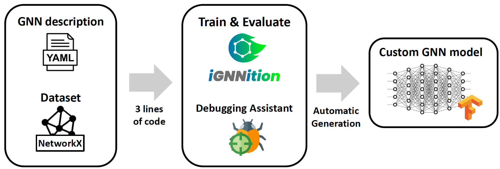

# IGNNITION at glance

## Why IGNNITION?
In recent years *Graph Neural Networks (GNNs)* have proven to be a very effective tool to design extremely succesul models. The main disadvantatge of its use is the high complexity of implementing the actual model as for many scientists/practitioners,implementing a model using native ML frameworks (e.g., Tensorflow, PyTorch) would require weeks or even months.

For this reason, several frameworks have been developed to help this users in this task (e.g., Graph Nets, DGL, Spektral). However, as far as we know, non of them ultimately achieve the goal, since they either lack of suffient flexibility, or they require the implementation of several parts of the algorithm.

*IGNNITION* is the first framework to overcome this difficulties and provide a framework that allows very fast prototyping of GNNs without any knowledge of ML frameworks, and with an exceptional flexibility, to adapt to basically any possible design of *GNNs*.

## Main functionalities:
### High level abstraction
Designing a *GNN* can be a very challanging, specially in complex problems where conceptualizing the *GNN* is a non-trivial task. For this reason, we introduce a novel abstraction technique, which we named *Multi-Stage Message Passing (MSMP)*, that is intended to help simpy and conceptualize a *GNN* model. The main advantatge of the use of this abstraction is that it represents visually the main parts of the *GNN* (helping to gain a visual intuition) meanwhile no major assumptions are made. Hence, our abstraction is general enough to adapt to basically any *GNN* design. 

### No coding is needed
*IGNNITION* is intended to be an extremely simple tool so that it is accessible to non-ML experts. In the image below we can observe how the user must only define the model description file using a declarative language (YAML) as well as to provide the dataset. Then, with three simple lines of code, the user can call the core engine of *IGNNITION* that will run the desired functionality and ultimately produce the trained GNN.



The image below shows a an example of how the *IGNNITION* framework can be called from a python script to start the training of a GNN.

```python
// main.py
import ignnition

def main():
    model = ignnition.create_model(model_dir = <PATH>)
    model.train_and_validate()
    
```

### High flexibility
To date, all existing frameworks for fast prototyping of *GNNs* either require the actual coding of the model, or lack of enough flexibility to support the vast range of possible *GNN* models. *IGNNITION* overcomes this issue as even though no *Tensorflow* code is needed, this does not incur in any flexibility loss. Consequently, potentially any *GNN* model can be implemented using our framework.

### Easy debugging
One of the most difficult tasks that an Machine Learning Engineer faces is the debugging phase. ML models act as black-boxes, which make it hard to understand its inner working. For this reason, *IGNNITION* incorporates a debugging assistant that will help users to easily identify possible malfunctions, and even suggest possible fixes for most errors in the definition of the model.

### Easy integration
Traditionally all ML models are strongly dependent on the dataset it is applied to, which implies that several non-trivial adaptations of the model are needed to be able to reuse it for a different dataset. To solve this problem, the definition of a *GNN* in *IGNNITION* is agnostic to the dataset it will be applied to, for which it can easily be integrated to any available dataset.

### High performance
Despite the fact that *IGNNITION* allows its users to isolate intirely from the actual implementation of the *GNN*, this does not incur in any major overhead time-wise. Hence, our implementations result to be essentially as efficient as an actual native *Tensorflow* implementation.


## Next step
*IGNNITION* is intended to be useful for both unexperienced and expert users in the field of *GNNs*. Nevertheless, we recommend unexperienced user to refer to section [GNN background](./what_are_gnns.md) which provides a basic intuition that can help you speed-up the design of your first GNN! For those with already some experiese, we recommend proceeding with the [installation guide](./installation.md) to start using *IGNNITION*.

