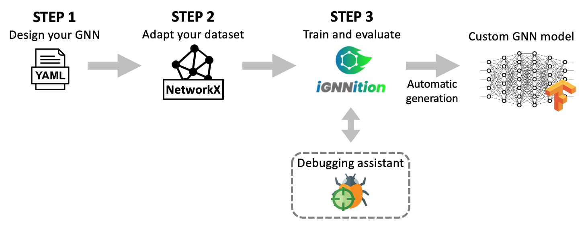

# User-guide introduction
*IGNNITION* enables users to define potentially very complex *GNNs* in a matter of a few hours. To do so, we require three main steps:

## STEP 1: Design your model
First of all, the user must define the inehrent architecture of the *GNN*. This task can be very challanging, specially as conceptualizing the elements forming the *GNN* is not trivial. To help conceptualizing the model, we propose a novel high-level abstraction, which you can check at [Multi-stage message passing](./msmp.md), and which will serve as the key-stone of our final implementation.

Once we have conceptualized our *GNN*, we must now translate it into the required *yaml* format. To do so, check [generate your GNN](./generate_your_gnn.md), where you will find all the details regarding the general structure of the *model_description.yaml* file, which will contain the architecture of the *GNN*. To design each of these sections, you will need to use the available keywords, which you can find explained in [keywords](./keywords.md), and in the form of a [cheat sheet](./cheat_sheet.md). Also check [use global variables](./global_variables.md) to learn about the use of global variables, as we consider it an essential tool to design your model.

Once you have familiarized youself with *IGNNTION*, we strongly recommend that you check out our [library of examples](./examples.md), where you will find implementations of well-known papers. This should serve as starting point for you implementation.

## STEP 2: Adapt your dataset
Once you have designed the *GNN*, you need to generate/adapt your dataset to be readible by *IGNNITION*. *IGNNITION* has been specifically designed to make this task fast and very intuitive. Moreover, you will find all the details in [generate your dataset](./generate_your_dataset.md) and in a practical example at [quick start tutorial](./quick_tutorial.md).

## STEP 3: Train and evaluate
Finally, we need only to call *IGNNITION* to train and evaluate this model. This can be done by two simple lines of *Python* code, which you will find at [train and evaluate](./train_and_evaluate.md).

## Optional: Debugging assistant
Of course, ML models typically require an extensive process of debugging to fix any possible malfunction. This task becomes specially cumbersome due to the black-box nature of *ML*, and even more so in the case of *GNNs*. To help in this regard, *IGNNITION* incorporates a debugging assistant that will help you greatly in this task. For more information, check [debugging assistant](./debugging_assistant.md).
