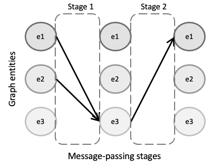
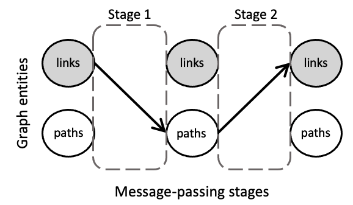

# Multi-stage Message Passing

In order to efficiently define *GNN* models, we propose a novel high-level abstraction called the *Multi-Stage Message Passing graph* (hereafter *MSMP* graph). Particularly, this abstraction mainly addresses the principles of simplicity and versatility. As such, it abstracts users from all the mathematical formulation behind *GNNs* and the programming obstacles imposed by traditional Deep Learning languages. Additionally, this abstraction also addresses the principle of reliability by providing a full picture of the message passing within *GNNs*, clearly identifying the different message passing phases and the relationships between the entities involved.

The *MSMP* graph abstraction provides an interface with a flexible modular design, providing support for any variant of state-of-the-art *GNN* architectures as well as custom combinations of individual components present in existing *GNNs* (e.g., messages, aggregations, updates, loss, normalization functions). In the networking field, *GNN* models are usually non-standard. They often need to be highly customized in order to adapt to complex network scenarios, usually addressing challenging modeling or optimization problems. Thus, proposed solutions typically require tailor-made *GNN* architectures including different element types in graphs (e.g., forwarding devices, links) and message-passing schemes divided in multiples phases sequentially arranged. In this context --- and in line with the focus on network applications of *IGNNITION ---* one main novelty of the proposed *MSMP* graph abstraction is that it provides support to define message passings divided in multiple stages and including different types of elements (also called *entities*). To the best of our knowledge, this enables to implement all the existing GNN architectures applied to networking to date.

Particularly, with the *MSMP* graph abstraction, a *GNN* design can be intuitively defined by a set of graph entities and how they relate to each other in a sequential order, which eventually describes a message-passing iteration of the *GNN*. Fig.~\ref{fig:abstraction_graph} illustrates an example of a *GNN* with three different entity types (*e1*, *e2* and *e3*). In this MSMP graph, we can observe two differentiated stages in the message passing. In the first stage, entities of type *e1* and *e2* send their hidden states to their neighbors of type *e3* according to the connections of the input graph. Then, in the second stage, $e3$ entities send their states to the linked entities of type *e1* and *e2*. This process is then repeated a number of iterations *T* to make the states converge to some fixed values.

Thus, *IGNNITION* supports any *GNN* that can be represented as an *MSMP* graph. This broadly includes the main state-of-the-art *GNN* architectures and all their variants, such as *Graph Attention Networks*, *Graph Convolutional Networks*, *Gated Neural Networks* , *Graph LSTM*, *Typed Graph Networks* , *Hypergraph Neural Networks*, and many others.

In order to further illustrate this abstraction, we shall focus on *RouteNet*, which is a
representative *GNN* model applied to networking. *RouteNet* was proposed as a solution to efficiently model performance in networks. To do this, in the original paper the authors formulate a complex mathematical model with a hypergraph that includes two types of entities: *(i)* the links of the input topology, and *(ii)* the end-to-end paths formed by the routing configuration. However, with *MSMP* graphs *RouteNet* can be easily defined by a two-stage message passing scheme including the two entities involved and how they exchange their states (as shown in the figure below).

In particular, in this *GNN* each *link* first shares its state with all its related paths (i.e., the *paths* that traverse the link). Afterward, each path sends its state to its related *links* (i.e., the *links* that form the *path*). Note that in this two-stage message passing, the input graph of the *GNN* does not have a direct mapping to the network topology itself, but instead graph nodes are the different entities included in the MSMP graph (i.e., links and paths), and edges are the relationships between these elements. Thus, messages are not necessarily sent physically over the network. They are just logical objects that represent the exchange of hidden states between links and paths.

In the end, this abstraction enables to create a simple interface with users, which can easily define their own *GNN* models adapted to specific problems, just by defining the entities involved and their relationships. Lastly, *IGNNITION* produces an efficient implementation of the designed *GNN* in *TensorFlow*. 
