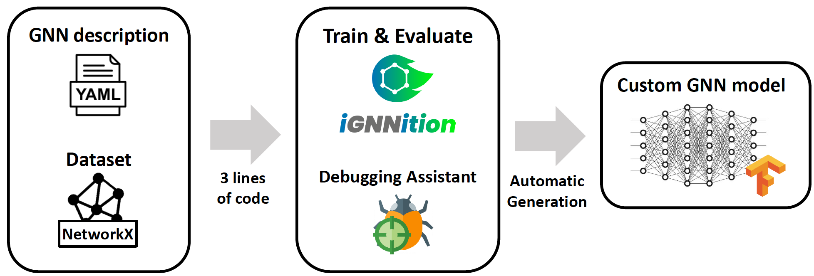

.. _ignnition_at_a_glance:

IGNNITION at a glance
=====================

Why IGNNITION?
--------------

In recent years *Graph Neural Networks (GNNs)* have proven to be a very
effective tool to design extremely successful models. The main disadvantage of its use is the high complexity of implementing the
actual model as for many scientists/practitioners, implementing a model
using native ML frameworks (e.g., Tensorflow, PyTorch) would require
weeks or even months.

For this reason, several frameworks have been developed to help this
users in this task (e.g., Graph Nets, DGL, Spektral). However, as far as
we know, non of them ultimately achieve the goal since they either lack
of sufficient flexibility, or they require the implementation of several
parts of the algorithm.

*IGNNITION* is the first framework to overcome these difficulties and
provide a framework that allows very fast prototyping of GNNs without
any knowledge of ML frameworks, and with exceptional flexibility, to
adapt to any possible design of *GNNs*.

Main functionalities:
---------------------

High-level abstraction
~~~~~~~~~~~~~~~~~~~~~~

Designing a *GNN* can be very challenging, especially in complex
problems were conceptualizing the *GNN* is a non-trivial task. For this
reason, we introduce a novel abstraction technique, which we named
*Multi-Stage Message Passing (MSMP)*, which is intended to help simpy and
conceptualize a *GNN* model. The main advantage of the use of this
abstraction is that it represents visually the main parts of the *GNN*
(helping to gain a visual intuition) meanwhile, no major assumptions are
made. Hence, our abstraction is general enough to adapt to any
*GNN* design.

No coding is needed
~~~~~~~~~~~~~~~~~~~

*IGNNITION* is intended to be an extremely simple tool so that it is
accessible to non-ML experts. In the image below we can observe how the
user must only define the model description file using a declarative
language (YAML) as well as to provide the dataset. Then, with three
simple lines of code, the user can call the core engine of *IGNNITION*
that will run the desired functionality and ultimately produce the
trained GNN.

   workflow

The image below shows an example of how the *IGNNITION* framework can
be called from a python script to start the training of a GNN.

.. code:: python

    // main.py
    import ignnition

    def main():
        model = ignnition.create_model(model_dir = <PATH>)
        model.train_and_validate()

High flexibility
~~~~~~~~~~~~~~~~

To date, all existing frameworks for fast prototyping of *GNNs* either
require the actual coding of the model or lack enough flexibility to
support the vast range of possible *GNN* models. *IGNNITION* overcomes
this issue as even though no *Tensorflow* code is needed, this does not
incur any flexibility loss. Consequently, potentially any *GNN* model
can be implemented using our framework.

Easy debugging
~~~~~~~~~~~~~~

One of the most difficult tasks that a Machine Learning Engineer faces
is the debugging phase. ML models act as black-boxes, which make it hard
to understand their inner working. For this reason, *IGNNITION*
incorporates a debugging assistant that will help users to easily
identify possible malfunctions, and even suggest possible fixes for most
errors in the definition of the model.

Easy integration
~~~~~~~~~~~~~~~~

Traditionally all ML models are strongly dependent on the dataset it is
applied to, which implies that several non-trivial adaptations of the
models are needed to be able to reuse it for a different dataset. To
solve this problem, the definition of a *GNN* in *IGNNITION* is agnostic
to the dataset, it will be applied to, for which it can easily be
integrated to any available dataset.

High performance
~~~~~~~~~~~~~~~~

Even though *IGNNITION* allows its users to isolate entirely
from the actual implementation of the *GNN*, this does not incur in any
major overhead time-wise. Hence, our implementations result to be
essentially as efficient as an actual native *Tensorflow*
implementation.

Next step
~~~~~~~~~~

*IGNNITION* is intended to be useful for both inexperienced and expert
users in the field of *GNNs*. Nevertheless, we recommend the inexperienced
user to refer to the section :ref:`GNN background <what-is-a-gnn>` which
provides a basic intuition that can help you speed up the design of your
first GNN! For those with already some experience, we recommend
proceeding with the :ref:`installation guide <installation>` to start
using *IGNNITION*.
