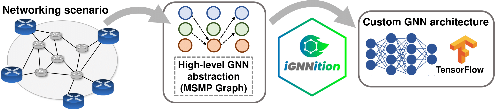

Welcome to IGNNITION
====================

Graph Neural Networks (GNNs) are becoming increasingly popular in
communication networks, where many problems are formulated as graphs
with complex relationships (e.g., topology, routing, wireless channels).
However, implementing a GNN model is nowadays a complex and
time-consuming task, especially for scientists and engineers of the
networking field, which often lack a deep background in neural network
programming (e.g., TensorFlow or PyTorch). This arguably prevents
networking experts to apply this type of neural networks to their
specific problems. *IGNNITION* is a TensorFlow-based framework for fast prototyping of GNNs. It provides a codeless programming interface, where
users can implement their own GNN models in a YAML file, without writing
a single line of TensorFlow. With this tool, network engineers are able
to create their own GNN models in a matter of few hours. *IGNNITION*
also incorporates a set of tools and functionalities that guide users
during the design and implementation process of the GNN. Check out our
:ref:`quick start tutorial <quick-step-by-step-tutorial>` to start using IGNNITION.
Also, you can visit our :ref:`examples library <examples>` with some
of the most popular GNN models applied to communication networks already
implemented.

   MSMP definition

Getting started
---------------

Installation
~~~~~~~~~~~~

Visit :ref:`installation <installation>` to have a detailed tutorial
on how to install *IGNNITION* and all its necessary dependencies.

IGNNITION at a glance
~~~~~~~~~~~~~~~~~~~~~

In the section :ref:`ignnition at a glance <ignnition_at_a_glance>`, we
provide an overview of the benefits of using *IGNNITION* with respect of
traditional tools for the implementation of custom GNN models.

Quick step-by-step tutorial
~~~~~~~~~~~~~~~~~~~~~~~~~~~

Because we believe that the best way to learn is by practicing, we
provide in :ref:`quick step-by-step tutorial <quick-step-by-step-tutorial>` an
example of how to implement a *GNN* from scratch, which should be a good starting point for any user.

About
-----

Learn more in :ref:`About us <about>`, about *Barcelona Neural
Networking Center* team which has carried out the development of
*IGNNITION*.

License
-------

Despite being an open-source project, in section
:ref:`License <license>` we provide the details on the released
license.

.. toctree::
   :maxdepth: 2
   :hidden:
   :caption: Getting Started

   ignnition_at_glance
   installation
   quick_tutorial

.. toctree::
   :maxdepth: 2
   :hidden:
   :caption: Background On GNNs

   motivation
   what_is_a_gnn

.. toctree::
   :maxdepth: 5
   :hidden:
   :caption: User Guide

   intro
   model_description
   keyword_definition
   generate_your_dataset
   train_and_evaluate
   debugging_assistant
   global_variables
   examples

.. toctree::
   :maxdepth: 2
   :hidden:
   :caption: Misc

   about
   contact_and_issues
   mailing_list
   contributing
   community_bylaws
   license
   citing
