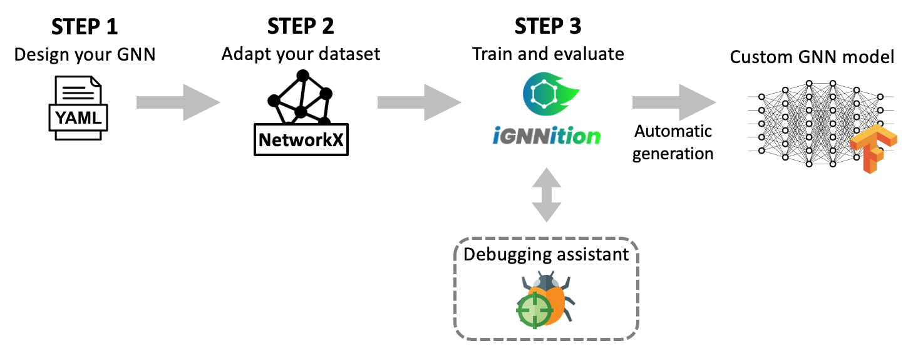

.. _user-guide:

User-guide introduction
=======================

*IGNNITION* enables users to define potentially very complex *GNNs* in a
matter of a few hours. To do so, we require three main steps:

STEP 1: Design your model
-------------------------

First of all, the user must define the inherent architecture of the
*GNN*. This task can be very challenging, especially as conceptualizing
the elements forming the *GNN* is not trivial. To help to conceptualize
the model, we propose a novel high-level abstraction, which you can
check at :ref:`Multi-stage message passing <multi-stage-message-passing>`, and
which will serve as the keystone of our final implementation.

Once we have conceptualized our *GNN*, we must now translate it into the
required *yaml* format. To do so, check :ref:`generate your
GNN <generate-your-gnn>`, where you will find
all the details regarding the general structure of the
*model\_description.yaml* file, which will contain the architecture of
the *GNN*. To design each of these sections, you will need to use the
available keywords, which you can find explained in
:ref:`keywords <keyword-definition>`.

Once you have familiarized yourself with *IGNNTION*, we strongly
recommend that you check out our :ref:`library of examples <examples>`,
where you will find implementations of well-known papers. This should
serve as a starting point for your implementation.

STEP 2: Adapt your dataset
--------------------------

Once you have designed the *GNN*, you need to generate/adapt your
dataset to be readable by *IGNNITION*. *IGNNITION* has been specifically
designed to make this task fast and very intuitive. Moreover, you will
find all the details in :ref:`generate your dataset <generate-your-dataset>`
and in a practical example at :ref:`quick start tutorial <quick-step-by-step-tutorial>`.

STEP 3: Train and evaluate
--------------------------

Finally, we need only to call *IGNNITION* to train and evaluate this
model. This can be done by two simple lines of *Python* code, which you
will find at :ref:`train and evaluate <training-and-evaluation>`.

Optional: Debugging assistant
-----------------------------

Of course, ML models typically require an extensive process of debugging
to fix any possible malfunction. This task becomes especially cumbersome
due to the black-box nature of *ML*, and even more so in the case of
*GNNs*. To help in this regard, *IGNNITION* incorporates a debugging
assistant that will help you greatly in this task. For more information,
check :ref:`debugging assistant <debugging_assistant>`.
