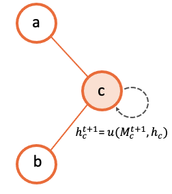

Model Descripton
================

.. _multi-stage-message-passing:

Multi-stage Message Passing
---------------------------

In order to efficiently define *GNN* models, we propose a novel high-level abstraction called the *Multi-Stage Message
Passing graph* (hereafter *MSMP* graph). Particularly, this abstraction mainly addresses the principles of simplicity
and versatility. As such, it abstracts users from all the mathematical formulation behind *GNNs* and the programming
obstacles imposed by traditional Deep Learning languages. Additionally, this abstraction also addresses the principle
of reliability by providing a full picture of the message passing within *GNNs*\ , clearly identifying the different
message passing phases and the relationships between the entities involved.

The *MSMP* graph abstraction provides an interface with a flexible modular design, providing support for any variant
of state-of-the-art *GNN* architectures as well as custom combinations of individual components present in existing
*GNNs* (e.g., messages, aggregations, updates, loss, normalization functions). In the networking field, *GNN* models
are usually non-standard. They often need to be highly customized in order to adapt to complex network scenarios,
usually addressing challenging modeling or optimization problems. Thus, proposed solutions typically require tailor-made
*GNN* architectures including different element types in graphs (e.g., forwarding devices, links) and message-passing
schemes divided in multiples phases sequentially arranged. In this context --- and in line with the focus on network
applications of *IGNNITION ---* one main novelty of the proposed *MSMP* graph abstraction is that it provides support
to define message passings divided in multiple stages and including different types of elements (also called
*entities*). To the best of our knowledge, this enables to implement all the existing GNN architectures applied to
networking to date.

.. image:: Images/general_msmp.png
   :target: Images/general_msmp.png
   :alt: General MSMP definition

Particularly, with the *MSMP* graph abstraction, a *GNN* design can be intuitively defined by a set of graph entities
and how they relate to each other in a sequential order, which eventually describes a message-passing iteration of the
*GNN*. Fig.~\ref{fig:abstraction_graph} illustrates an example of a *GNN* with three different entity types (*e1*, *e2*
and *e3*). In this MSMP graph, we can observe two differentiated stages in the message passing. In the first stage,
entities of type *e1* and *e2* send their hidden states to their neighbors of type *e3* according to the connections
of the input graph. Then, in the second stage, $e3$ entities send their states to the linked entities of type *e1* and
*e2*. This process is then repeated a number of iterations *T* to make the states converge to some fixed values.

Thus, *IGNNITION* supports any *GNN* that can be represented as an *MSMP* graph. This broadly includes the main
state-of-the-art *GNN* architectures and all their variants, such as *Graph Attention Networks* , *Graph Convolutional
Networks*, *Gated Neural Networks*, *Graph LSTM*, *Typed Graph Networks*, *Hypergraph Neural Networks*, and many others.

In order to further illustrate this abstraction, we shall focus on *RouteNet*, which is a representative *GNN* model
applied to networking. *RouteNet* was proposed as a solution to efficiently model performance in networks. To do this,
in the original paper the authors formulate a complex mathematical model with a hypergraph that includes two types of
entities: *(i)* the links of the input topology, and *(ii)* the end-to-end paths formed by the routing configuration.
However, with *MSMP* graphs *RouteNet* can be easily defined by a two-stage message passing scheme including the two
entities involved and how they exchange their states (as shown in the figure below).

.. image:: Images/msmp_routenet.png
   :target: Images/msmp_routenet.png
   :alt: RouteNet MSMP definition

In particular, in this *GNN* each *link* first shares its state with all its related paths (i.e., the *paths* that
traverse the link). Afterward, each path sends its state to its related *links* (i.e., the *links* that form the
*path*). Note that in this two-stage message passing, the input graph of the *GNN* does not have a direct mapping
to the network topology itself, but instead graph nodes are the different entities included in the MSMP graph (i.e.,
links and paths), and edges are the relationships between these elements. Thus, messages are not necessarily sent
physically over the network. They are just logical objects that represent the exchange of hidden states between links
and paths.

In the end, this abstraction enables to create a simple interface with users, which can easily define their own *GNN*
models adapted to specific problems, just by defining the entities involved and their relationships. Lastly, *IGNNITION*
produces an efficient implementation of the designed *GNN* in *TensorFlow*.

.. _generate-your-gnn:

Generate your GNN
-----------------

In order to define the architecture of the GNN we aim to create, the user is asked to define a model_description.yml
file. This file will contain several sections that will define different aspects of our GNN. More specifically,
the sections we must filled are:

.. contents::
    :local:
    :depth: 1

Let us now go a little bit in more detail into each of these sections.

.. _entity-definition:

Step 1: Entity definition
^^^^^^^^^^^^^^^^^^^^^^^^^

When designing a GNN, we might find situations in which not all the nodes in the graph behave /represent the same
object. For this, we might need to consider different behaviours depending on the type of node in question. For this,
we shall refer to an entity as a type of node in the graph.

.. image:: Images/entities.png
   :target: Images/entities.png
   :alt: MSMP definition

From this example, we can observe that two entities must be created. Consequently, our model_description file must
include a definition for each of them. Let us briefly describe how this can be done.

.. code-block:: yaml

   - entity: entity1
     state_dimension: 32
     initial_state:
     - type: build_state
       input: [feature1, feature2]

   - entity: entity2
     state_dimension: 32
     initial_state:
     - type: build_state
       input: [feature3]

In the code from above, we can see that we simply have to create a list of two entities (this will depend on the
problem). Then, for each of the entities we first indicate its name, which we will use throughout the rest of the
definition of the GNN to refer to these type of nodes. Additionally, we provide the dimension of the states that
each of these nodes will have. Finally, we must indicate how the initial state is computed. For this definition,
we must provide a list of "operations" which increasingly define the the resulting initial state. For simplicity,
in these example, we simply define an initial state with *feature1* and *feature2*, and the rest of dimensions will
be padded with 0s. Note that we do similarly with *entity2*.

Step 2: Message passing definition
^^^^^^^^^^^^^^^^^^^^^^^^^^^^^^^^^^

At this point, we must define the core part of the GNN algorithm, which is the neural message-passing phase.
In this phase, we define how the different nodes in the graph exchange messages with each other, in order to produce
node-embeddings that properly consider the structural information of the graph.

For this, let us define some terminology that will help us to easily describe potentially very complex GNN.

What is a single message-passing?
~~~~~~~~~~~~~~~~~~~~~~~~~~~~~~~~~

The message-passing phase is the process of nodes from the graph sending messages to other nodes of the graph. Note,
however, from the previous sections that in a complex setting, we might have numerous different types of nodes in the
graph which we want to consider independently. For this, we must further generalize the idea of message-passing to
make the appropriate considerations.

In this context, thus, we shall refer to a single message-passing to the process of the nodes that are of the source
entity types *(a,b,..., k)* sending messages to a destination entity *dest_entity*.

In the most simple scenario, we might want to define a single message-passing as the process of nodes of type *a*
sending messages to the nodes of type *b*. In other scenarios, however, entities *a* and *b* might be sending
simultaniously messages to another entity's nodes *c*.

How to define a single message-passing?
~~~~~~~~~~~~~~~~~~~~~~~~~~~~~~~~~~~~~~~

At this point, in order to illustrate this idea, let us suppose we are considering a single message-passing, such that
nodes from entities *a* and *b* simultaniously send messages to the corresponding nodes of entity *c*.
For this, we must define the following functions:

.. contents::
    :local:
    :depth: 1

Message function
""""""""""""""""

This message function is defined for each of the source entities to the given destination entity. The message
function will define how the source nodes will form the message that they will send to their corresponding destination
nodes. Below we provide a visualization for this process through an arbitrary graph of 3 different nodes.

.. image:: Images/message.png
   :target: Images/message.png
   :alt: MSMP definition

Aggregation function
""""""""""""""""""""

Once we have defined the message function for each of the source entities (in this case, for the source entity *a* and
for the entity *b* respectively), we need to define the aggregation function. The aggregation function defines how each
of the destination nodes will take all the messages received from both entity *a* and *b*, and produce one single input.
For this, *IGNNITION*\ , as seen before, allows a pipe-line of operations which incrementaly allow users to define
potentially very complex strategys for this aggregation function. Below we show an illustration of this process,
for simplicity, with an aggregation function consisting of a single operation which sums over all the messages into a
single final input.

.. image:: Images/aggregation.png
   :target: Images/aggregation.png
   :alt: MSMP definition

Update function
"""""""""""""""

Finally, we reach the point in which each of the destination nodes has produced an aggregated input of all the messages
received. It just remains to create the corresponding update function of the destination entity that describes how it
will use this information to update its current hidden state. Following the same squema used before, the illustration
below exemplifies graphically this process.

Using stages to define chronological orderings?
~~~~~~~~~~~~~~~~~~~~~~~~~~~~~~~~~~~~~~~~~~~~~~~

So far, we have talked about how we can create a single message-passing. One must note, however, that a complex GNN may
contain many of this single message-passings. For this we need to be able to properly order them chronologically.

In order to simplify this ordering, we create what we called a *stage*. A stage simbolizes a given time-step of the
algorithm. Then, to create our GNN, we can create several *stages*\ , and we can then assign single message-passings to
a given stage.

To illustrate this, let us suppose we have created three single message-passings from the entities we have in the
graph. Then, for instance, we might want to perform simultaniously the first two single message-passings, and once they
are done, we execute the third one.

This can be done by creating two different stages. We then assign the first two single message-passings to the first
stage (first time-step) and then the third single message-passing to the second stage (second time-step).

.. image:: Images/general_description_stages.png
   :target: Images/general_description_stages.png
   :alt: stages definition

Defining the message-passing phase
~~~~~~~~~~~~~~~~~~~~~~~~~~~~~~~~~~

First of all, we must define the number of iterations (num_iterations). This indicates the number of times that all the
given stages will perform all their single message-passings. Afterwards, we can proceed to define a list of *stages*.
For sake of simplicity, let us only define one, as two define more, we must just include more elements in the list of
*stages*.

To define a *stage*\ , the user must define all the *stage_message_passings*, these being all the *single
message-passings* that must be executed during these time step (all of them simultaniously). Note that for
each of them we define the three functions mentioned before (message function, aggregation function and update
function). Visit :ref:`keywords <keyword-definition>` to get more information about the exact
keywords that you can use in these sections.

.. code-block:: yaml

   message_passing:
       num_iterations: 8
       stages:
           stage_message_passings:
               destination_entity: c
               source_entities:
                   - name: a
                     message:
                           type: direct_assignment
                   - name: b
                     message:
                           type: direct_assignment
               aggregation: 
                   - type: sum

               update: 
                   type: recurrent_neural_network
                   nn_name: recurrent1

Step 3: Readout definition
^^^^^^^^^^^^^^^^^^^^^^^^^^

Once we have defined the message passing, it remains to define the readout. The readout function is the one in charge
of taking some/all of the final states computed during the message-passing, and using them appropritly to predict the
final label. For this, again, we allow full flexibility for this definition in the form of a pipe-line of operations
(as seen before). For sake of simplicity, let's suppose we aim to make a prediction over a global property of the
graph. For this, we want to sum together all the final states of the nodes of type *a*\ , and then pass this to a
neural network that computes the *output_label*. In this case, we would need to define two operations. One that sums
all the states together, and another one that passes this output to the neural network. Below we show how this would
be done.

.. code-block:: yaml

   readout:
   - type: pooling
     type_pooling: sum
     input: [a]
     output_name: pooled_a
   - type: feed_forward
     input: [pooled_a]
     nn_name: readout_model
     output_label: my_label

As you can see, we make use of the field *output_name* to define a name for the output of the first operation, which
can then use as input for the second operation.

.. _neural_networks_definition:

Step 4: Internal neural networks definition
^^^^^^^^^^^^^^^^^^^^^^^^^^^^^^^^^^^^^^^^^^^

Finally, it only remains to define the Neural Networks. Notice that in all the previous sections we have not
explicitely defined the actual architecture of the neural network, but rather only referenced it by its name. In this
section, we must indicate the actual architecture of each of them.

For instance, we show below how to create the *readout_model* Neural Network that we referenced in the readout. For
this, we must define each of its layers.

.. code-block:: yaml

   neural_networks:
   - nn_name: readout_model
     nn_architecture:
     - type_layer: Dense
       units: 256
       activation: sigmoid
     - type_layer: Dropout
       rate: 0.5
     - type_layer: Dense
       units: 1

In this example, we are linking the name *readout_model* to a neural network with three layers of type Dense, Dropout
and another Dense. These definition is done through a list of layers (which can be arbitrarely long). An important
consideration is that *IGNNTION* allows the use of all the layer types presented in
`keras library <https://www.tensorflow.org/api_docs/python/tf/keras/layers>`_. Moreover, each of this layers can have
numerous parameters that tune its properties. For this, again, we support all the parameters accepted by Keras for
each layer respectively. This is done by simply adding them to the properties of each layers (e.g., the activation
function in the first Dense layer). If a parameter is not defined (in case this is stated to be an optional parameter
in the Keras Documentation), then *IGNNITION* will use the default parameter used by Keras.

Putting it into practice
^^^^^^^^^^^^^^^^^^^^^^^^

So far, this section has covered in a very general way how to define a *GNN*. To fully get your hands on this topic,
we recommend you to check our :ref:`quick tutorial <quick-step-by-step-tutorial>` where we put all these concepts into
practice to solve the specific problem of finding the *shortest-path* of a graph.

.. _keyword-definition:

Keyword definition
------------------

In this section we will focus in more depth on what are the keywords available to design each of the sections that
themselves define the GNN, and how to use them. More specifically, we will cover the keywords for each of the following
sections.

.. contents::
    :local:
    :depth: 1

Step 1: Entity definition
^^^^^^^^^^^^^^^^^^^^^^^^^

In order to create the entities, we must define a list "entities". For this, we must define an object "Entity".
We shall now describe the different keywords that the user must / can define to model the new entity, these being:

.. contents::
    :local:
    :depth: 1

----

Parameter: name
~~~~~~~~~~~~~~~

**Description:** Name that we assing to the new entity. This name is important as we will use it from now on to reference the nodes that belong to this entity.

**Accepted values:** String of the choice of the user.

E.g., below we show how we would define an entity of name *entity1*.

.. code-block:: yaml

   name: entity1

----

Parameter: state_dim
~~~~~~~~~~~~~~~~~~~~

**Description:** Dimension of the hidden states of the nodes of this entity.

**Accepted values:** Natural number

.. code-block:: yaml

   state_dim: 32

----

Parameter: initial_state
~~~~~~~~~~~~~~~~~~~~~~~~

**Description:** Array of Operation object defining incrementally the initial_state.

**Accepted values:** Array of `Operation objects <#operation-object>`_.

Step 2: Message-passing phase
^^^^^^^^^^^^^^^^^^^^^^^^^^^^^

Now we define the keywords that the user can use to design the message passing phase of the present *GNN*. To do so, we will cover the following keywords:

.. contents::
    :local:
    :depth: 1

Parameter: num_iterations
~~~~~~~~~~~~~~~~~~~~~~~~~

**Description:** Number of times that all the stages must be repeated (iteration of the message passing phase).

**Accepted values:** Natural number (Normally between 3 and 8)

.. code-block:: yaml

   num_iterations: 8

----

Parameter: stages
~~~~~~~~~~~~~~~~~

**Description:** Stages is the array of stage object which ultimately define all the parts of the message passing.

**Accepted values:** Array of [Stage objects](#stage, each of which represents a time-step of the algorithm.

Stage:
""""""

To define a stage, we must define all the single message passings that take place during that stage (a given time-step
of the algorithm). This is to define all the single message-passing which define how potentially many entities send
messages to a destination entity.

Parameter: stage_message_passings
~~~~~~~~~~~~~~~~~~~~~~~~~~~~~~~~~

**Description:** Contains the single message-passings (the process of one entity nodes sending messages to another one),
which we assign to this stage (time-step of the algorithm)

**Accepted values:** Array of :ref:`Single message-passing objects <single-message-passing>`.

.. _single-message-passing:

Single message-passing:
~~~~~~~~~~~~~~~~~~~~~~~

This object defines how the nodes of potentially many entity types send messages simultaniously to the nodes of a
given destination entity. To do so, we must define the following parameters:

.. contents::
    :local:
    :depth: 1

Parameter: destination entity
~~~~~~~~~~~~~~~~~~~~~~~~~~~~~

**Description:** Name of the destination entity of this single message-passing. In other words, the entity nodes
receiving the messages.

**Accepted values:** String. It must match the name of an entity previously defined (see :ref:`entity name <entity_name>`).

.. code-block:: yaml

   destination_entity: my_dst_entity

----

Parameter: source_entities
~~~~~~~~~~~~~~~~~~~~~~~~~~

**Description:** Array of the source entities sending messages to the destination entity (defined before) in this
single message-passing. This is, all these sending entities will send messages simultaniously to the defined
destination entity.

**Accepted values:** Array of :ref:`Souce entity objects <entity_object>`.

----

Parameter: aggregation
~~~~~~~~~~~~~~~~~~~~~~

**Description:** Defines the aggregation function, which will take as input all the messages received by each of the
destination nodes respectively, and aggregates them together into a single representation. Note that, to define
potentially very complex function, we define this as a pipeline of aggregation operations

**Accepted values:** Array of :ref:`Aggregation operation <aggregation_operation>`.

----

Parameter: update
~~~~~~~~~~~~~~~~~

**Description:** Defines the update function. This function will be applied to each of the destination nodes, and
given the aggregated input and the current hidden state, will produce the updated hidden-state.

**Accepted values:** :ref:`Update operation <update-operation>`.

.. _entity_object:

Source entity object:
^^^^^^^^^^^^^^^^^^^^^

This object ultimately defines how the nodes of a source entity send nodes to the destination entity. This definition
also includes the :ref:`message function <message-function-object>` which will specify how this souce entity forms its
messages. To define this object, we must specify the following parameters:

* `Parameter: name <#parameter-name>`_
* `Parameter: message <#parameter-message>`_

----

.. _entity_name:

Parameter: name
~~~~~~~~~~~~~~~

**Description:** Name of the source entity.

**Accepted values:** String. It must match the name of an entity defined previously.

.. code-block:: yaml

   name: source1

----

Parameter: message
~~~~~~~~~~~~~~~~~~

**Description:** Message function which defines how the source entity nodes form the messages to be sent to the
destination entity.

**Accepted values:** :ref:`Message function <message-function-object>`

.. _message-function-object:

Message function object:
~~~~~~~~~~~~~~~~~~~~~~~~

One of the most important aspects when defining a message passing between a source entity and a destination entity is
to specify how the source entities form their messages. To do so, and to support very complex functions, we device a
pipe-line of operations, which will be specified in :ref:`Operation object <operation-object>`. An operation performs
some calculation and then returns a reference to its output. By doing so, we can concatenate operations, by referencing
previous results to obtain increasingle more complicated results. Note that the messages will be, by default, the
result of the last operation.

Take a look at the subsection (:ref:`Operation objects <operation-object>` to find the operations accepted for this
sections). We, however, introduce a new specific *Operation* which can be specially usefull to define a message
function, which is the :ref:`Direct_assignment <direct-assignement>` operation.

.. _direct-assignement:

Operation: Direct_assignment
""""""""""""""""""""""""""""

This operation simply assigns the source hidden states as the message to be sent. By using it, hence, each source
node will use its hidden state as the message to be send to each of its neighbour destination node.

.. code-block:: yaml

   type: direct_assignment

Usage example:
""""""""""""""

Let us put all of this together to see an example of how to define a *source_entity* in which nodes of type *entity1*
send their hidden states to the corresponding destination nodes.

.. code-block:: yaml

   source_entities:
   - name: entity1
     message:
        - type: direct_assignment

But as mentioned before, we might want to form more complicated message functions. Below we show a more complicated
examples using two :ref:`Neural Network operation <neural-network-operation>`, and which illustrate the power of the
pipe-line of operations. In this pipe-line, we can observe that we first define a neural network which take as input
the source entity nodes (using the keyword *source*). Then we save the input by the name a *my_output1* and we reuse
it as input of the second neural network altogether with each of the destination nodes respectively. The output of
this neural network (for each of the edges of the graph) will be the message that the source node will send to the
destination node.

.. code-block:: yaml

   source_entities:
   - name: entity1
     message:
        - type: neural_network
          input: [source]
          output_name: my_output1
        - type: neural_network
          input: [my_output1, target]

An important note is that for the definition of neural networks in the message function, *IGNNITION* reserves the use
of *source* and *target* keywords. These keywords are used to reference to the source hidden states of the entity
(in this case entity1), and to reference the destination hidden states of the target node.

.. _aggregation_operation:

Aggregation operation:
~~~~~~~~~~~~~~~~~~~~~~

This object defines the *aggregation function a*. This is to define a function that given the *k* input messages of a
given destination node *(m_1, ..., m_k)* , it produces a single aggreagated message for each of the destination nodes.

.. math::

   aggregated_message = a(m_1, ..., m_k)

For this, we provide several keywords that reference the most common aggregated functions used in state-of-art *GNNs*,
which should be specified as follows:

.. code-block:: yaml

   aggregation:
        - type: sum/min/max/ordered/...

Below we provide more details on each of this possible aggregation functions, these being:

.. contents::
    :local:
    :depth: 1

----

Option 1: sum
"""""""""""""

This operation aggregates together all the input messages into a single message by summing the messages together.

.. math::

    AggregatedMessage_j = \sum_{i \in N(j)} m_i

Example:

.. math::

    m_1 = [1,2,3]

    m_2 = [2,3,4]

    AggregatedMessage_j  = [3,5,7]

In *IGNNITION*, this operation would be represented as:

.. code-block:: yaml

   aggregation:
       - type: sum

----

Option 2: mean
""""""""""""""

This operation aggregates together all the input messages into a single message by averaging all the messages together.

.. math::

    AggregatedMessage_j = \frac{1}{deg(j)} \sum_{i \in N(j)} m_i

Example:

.. math::

    m_1 = [1,2,3]

    m_2 = [2,3,4]

    AggregatedMessage_j = [1.5,2.5,3.5]

In *IGNNITION*, this operation would be defined as:

.. code-block:: yaml

   aggregation:
       - type: mean

----

Option 3: min
"""""""""""""

This operation aggregates together all the input messages into a single message by computing the minimum over all the
received messages.

.. code-block:: yaml

   aggregation:
       - type: min

----

Option 4: max
"""""""""""""

This operation aggregates together all the input messages into a single message by computing the maximum over all the
received messages.

.. code-block:: yaml

   aggregation:
       - type: max

----

Option 5: ordered
"""""""""""""""""

This operation produces an aggregated message which consists of an array of all the input messages. This aggregation
is intended to be used with a RNN udpate function. Then, the *RNN* automatically updates the hidden state by first
treating the first message, then the second message, all the way to the *k-th* message.

.. math::

    AggregatedMessage_j = (m_1|| ... ||m_k)

.. code-block:: yaml

   aggregation:
       - type: ordered

----

Option 6: attention
"""""""""""""""""""

This operation performs the attention mechanism described in paper `Graph Attention Networks <https://arxiv.org/abs/1710.10903>`_.
Hence, given a set of input messages *(m_1, ..., m_k)*\ , it produces a set of *k* weights *(a_1, ..., a_k)*.
Then, it performs a weighted sum to end up producing a single aggregated message.

.. math::

    e_{ij} = \alpha(W * h_i, W * h_j)

    \alpha_{ij} = softmax_j(e_{ij})

    AggregatedMessage_j = \sum_{i \in N(j)} m_i * alpha_{ij}

.. code-block:: yaml

   aggregation:
       - type: attention

----

Option 7: edge-attention
""""""""""""""""""""""""

This aggregation function performs the edge-attention mechanism, described in paper
`Edge Attention-based Multi-Relational Graph Convolutional Networks <https://www.arxiv-vanity.com/papers/1802.04944/>`_.
This is based on a variation of the previous "attention" strategy, where we follow a different approach to produce the
weights *(a_1, ..., a_k)*. We end up, similarly, producing the aggregated message through a weighted sum of the input
messages and the computed weights.

.. math::

    e_{ij} = f(m_i, m_j)

    AggregatedMessage_j = \sum_{i \in N(j)} e_{ij} * m_i

Notice that this aggregation requires of a neural network *e* that will compute an attention weight for each of
the neighbors of a given destination node, respectively. Consequently, in this case, we need to include a new parameter
*nn_name* , as defined in :ref:`nn_name <param-nn-name>`. In this field, we must include the name of the NN, which
we define later on (as done for any NN). In this case, however, remember that this NN must return a single value, in
other words, the number of units of the last layer of the network must be 1. This is because we want to obtain a single
value that will represent the weight for each of the edges respectively.

.. code-block:: yaml

   aggregation:
       - type: edge_attention
         nn_name: my_network

----

Option 8: convolution
"""""""""""""""""""""

This aggregation function performs the very popular convolution mechanism, described in paper `Semi-supervised
classification with Graph Convolutional Networks <https://arxiv.org/pdf/1609.02907.pdf>`_. Again, we aim to find a
set of weights *(a_1, ..., a_k)* for the *k* input messages of a given destination node. In this case, it follows
the formulation below.

.. math::

    AggregatedMessage_j = \sum_{i \in N(j)} \frac{1}{\sqrt{deg_i * deg_j}} * h_i * W

.. code-block:: yaml

   aggregation:
       - type: convolution

----

Option 9: concat
""""""""""""""""

This aggregation function is specially thought for the cases in which we have a list of messages sent from messages of
entity type *"entity1"* and a list of messages from nodes of entity type *"entity2"*. Then, this aggregation function
will concatenate together this two lists by the axis indicated in the following field "concat_axis". Then, similarly
than with the "ordered" function, we would pass this to an *RNN*, which will update itself iteratively with all the
messages received.

Parameter: concat_axis
######################

**Description:** Axis to use for the concatenation. 

**Accepted values:** 1 or 2

Given the two lists of messages:

.. math::

    M_{entity_1} = [[1,2,3],[4,5,6]]

    M_{entity_2} = [[4,5,6],[1,2,3]]

If concat_axis = 1, we will get a new message 

.. math::

    AggregatedMessage_j = [[1,2,3,4,5,6], [4,5,6,1,2,3]]

If concat_axis = 2, we weill get a new message 

.. math::

    AggregatedMessage_j = [[1,2,3], [4,5,6],[4,5,6],[1,2,3]])

----

Option 10: interleave
~~~~~~~~~~~~~~~~~~~~~

**Description:** This aggregation concatenates both message by interleaving them.

Given the two lists of messages:

.. math::

    M_{entity_1} = [1,2,3]

    M_{entity_2} = [4,5,6]

    AggregatedMessage_j = [1,4,2,5,3,6]

.. code-block:: yaml

   aggregation:
       - type: interleave

Option 11: neural_network
"""""""""""""""""""""""""

**Description:** So far we have looked at examples where the aggregated function is defined with a single operation
(e.g., max,min,mean...). In some ocasions, however, we must build more complicated functions. This operation, thus,
allows to take the results of previous operations and pass them through a NN to compute a new value.

**Accepted values:** :ref:`Neural network operation <neural-network-operation>`

**Example of use:**
In this case, we need to include the parameter *output_name* at the end of each of the operations that preceed the
neural network. This will store each of the results of the operations, which we will then reference in the *neural
network operation*. Let us see this with an example

.. code-block::

   aggregation:
       - type: max
         output_name: max_value
       - type: min
         output_name: min_value
       - type: attention
         output_name: attention_value
       - type: neural_network
         input: [max_value, min_value, attention_value]
         nn_name: aggregation_function

In this example we compute the max value, the min and the result of applying the attention to the messages received by
each of the destination nodes, respectively. Then, the neural network takes as input the results of each of the
previous operations, and computes the final aggregated message, used for the update.

.. _update-operation:

Update operation:
~~~~~~~~~~~~~~~~~

In order to define the update function, we must specify a *Neural Network*. Note that the syntax will be the same no
matter if the *NN* is a *feed-forward* or a *RNN*. To define it, we must only specify two fields: which are the *type*
and the *nn_name*.

.. contents::
    :local:
    :depth: 1

Parameter: type
"""""""""""""""

**Description:** This parameter indicates the type of update function to be used
**Accepted values:** Right now the only accepted keyword is *neural_network*. We will soon however include new keywords.

.. _param-nn-name:

Parameter: nn_name
""""""""""""""""""

**Description:** Name of the Neural Network to be used for the upate.

**Accepted values:** String. The name should match a *NN* created in :ref:`Step 4 <neural_networks_definition>`

Below we present an example of how an update function can be defined. Note that in this case the update will be using
the *NN* named *my_neural_network*, and which architecture must be later defined.

.. code-block:: yaml

   update: 
       type: neural_network
       nn_name: my_neural_network

Step 3: Readout
^^^^^^^^^^^^^^^

Just as for the case of the message function, the readout function can potentially be very complex. For this, we
follow a similar approach. We define the readout as a pipe-line of :ref:`Operation object <operation-object>` which
shall allow us to define very complex functions. Again, each of the operations will keep the field *output_name*
indicating the name with which we can reference/use the result of this operation in successive opeartions.

The main particularity for the defintion of the readout is that in one of the operations (normally the last one),
will have to include the name of the *output_label* that we aim to predict. To do so, include the keyword presented
below as a property of last *Operation* of your readout function (the output of which will be used as output of
the *GNN*\ ).

Another important consideration is that in this case, the user can use *entity1_initial_state* as part of the input
of an operation (where *entity1* can be replaced for any entity name of the model). With this, the operation will take
as input the initial hidden states that were initialized at the beginning of the execution, and thus, before the
message-passing phase.

Parameter: output_label
~~~~~~~~~~~~~~~~~~~~~~~

**Description:** Name referencing the labels that we want to predict, which must be defined in the dataset.

**Allowed values:** Array of strings. The names should match the labels specified in the dataset.

Let us see this with a brief example of a simple readout function based on two
:ref:`Neural Network operations <neural-network-operation>`. In this case we apply two neural networks which are i
ntially to each of the nodes of type *entity1*. Then, the output is concatenated together with each of the nodes of
type *entity2* (as long that there is the same number of nodes of each entity) and then applied to the second neural
network *my_network2*. Note that the last operation includes the definition of *my_label*, which is the name of the
label found in the dataset. To specify this label, we write *$my_label* so as to indicate that this keywords refers to
data that *IGNNITION* can find in the corresponding dataset.

.. code-block:: yaml

   readout:
   - type: neural_network
     input: [entity1]
     nn_name: my_network1
     output_label: output1
   - type: neural_network
     input: [output1, entity2]
     nn_name: my_network2
     output_label: [$my_label]

Notice, however, that *output_label* may contain more than one label. For instance, consider the case in which we
want that the readout function predicts two properties of a node, namely *label1* and *label2*. For simplicity, let us
consider these labels to be single values --even though the same proceduce applies when they represent 1-d arrays. For
this, we make the following adaptations of the previous model:

.. code-block:: yaml

   readout:
   - type: neural_network
     input: [entity1]
     nn_name: my_network1
     output_label: output1
   - type: neural_network
     input: [output1, entity2]
     nn_name: my_network2
     output_label: [$label1, $label2]

In this case, hence, *my_network2* will output two predictions, one for each of the target labels. Then, *IGNNITION*
will internally process this and backpropagate accordingly, so as to force the GNN to learn to predict both properties,
simultaniously.

.. _operation-object:

Operation object:
^^^^^^^^^^^^^^^^^

We now review the different options of *Operations* that *IGNNITION* allows, and which can be used in many of the parts
of the *GNN* (e.g., message function, update function, readout function...). All these possible operations are:

.. contents::
    :local:
    :depth: 1

Operation 1: product
~~~~~~~~~~~~~~~~~~~~~~

This operation will perform the product of two different inputs. Let us go through the different parameters that we
can tune to customize this operation.

.. contents::
    :local:
    :depth: 1

----

Parameter: input
""""""""""""""""

**Description:** Defines the set of inputs to be fed to this operation.

**Allowed values:** Array of two strings, defining the two inputs of the *product operation*.

Notice that if a string from the input references a feature from the dataset, the name must always be preceeded by a
# symbol. This will indicate *IGNNITION* that such keyword references a value present in the dataset.

----

Parameter: output_name
""""""""""""""""""""""

**Description:** Defines the name by which we can reference the output of this operation if successive operations.

**Allowed values:** String

----

Parameter: type_product
"""""""""""""""""""""""

**Description:** Defines the type of product that we use (e.g., element-wise, matrix multiplication, dot-product)

**Allowed values:** [dot_product, element_wise, matrix_mult]

Let us explain in more detail what each of the following keywords stands for:

.. contents::
    :local:
    :depth: 1

----

Option 1: dot_product
#####################

**Description:** Computes the dot product between two inputs *a* and *b*. Note that if the inputs are two arrays
*a = (a_1, a_2, ... , a_k)* and *b = (b_1, ,b_2, ... , b_k)*, then the dot product is applied to *a_i* and *b_i*
respectively.

**Allowed values:** String. Name of an entity or output of a previous operation. 

Below we show an example of a readout function which first computes the *dot_product* between nodes of type *entity1*
and *entity2*\ , respectively. Then, the result of each of these operations are passed to a *Neural Network* that
compute the prediction.

.. code-block:: yaml

   readout:
   - type: product
     type_product: dot_product
     input: [entity1, entity2]
     nn_name: my_network1
     output_label: output1
   - type: neural_network
     input: [output1, entity2]
     nn_name: my_network2
     output_label: [$my_label]

----

Option 2: element_wise
######################

**Description:** Computes the element-wise multiplication between two inputs *a* and *b*. Note that if the inputs are
two arrays *a = (a_1, a_2, ... , a_k)* and *b = (b_1, ,b_2, ... , b_k)*\ , then the element-wise multiplication is
applied to *a_i* and *b_i* respectively.

**Allowed values:** String. Name of an entity or output of a previous operation. 

Below we show an example of a readout function which first computes the *element_wise* multiplication between nodes of
type *entity1* and *entity2*, respectively. Then, the result of each of these operations are passed to a *Neural
Network* that compute the prediction.

.. code-block:: yaml

   readout:
   - type: product
     type_product: dot_product
     input: [entity1, entity2]
     nn_name: my_network1
     output_label: output1
   - type: neural_network
     input: [output1, entity2]
     nn_name: my_network2
     output_label: [$my_label]

----

Option 3: matrix_mult
#####################

**Description:** Computes the matrix multiplication between two inputs *a* and *b*. Note that if the inputs are two
arrays *a = (a_1, a_2, ... , a_k)* and *b = (b_1, ,b_2, ... , b_k)*\ , then the matrix multiplication is applied to
*a_i* and *b_i* respectively.

**Allowed values:** String. Name of an entity or output of a previous operation. 

Below we show an example of a readout function which first computes the *dot_product* between nodes of type *entity1*
and *entity2*\ , respectively. Then, the result of each of these operations are passed to a *Neural Network* that
compute the prediction.

----

.. _neural-network-operation:

Operation 2: neural_network
~~~~~~~~~~~~~~~~~~~~~~~~~~~

Similarly to the neural_network operations used in the *message* or *update* function, we just need to reference the
neural network to be used, and provide a name for the output. Then, given some input (:math:`a`) and a neural network that we
define (:math:`f`), this operation performs the following:

.. math::

    output\_name = f(a)

Below we show a code-snipped of what a *neural_network* operation would look like, and we present afterward each of
its possible options. This neural network takes as input all the states of the nodes of type *entity1* , and pass
them (separately) to our *NN* named *my_network*. Finally it stores the results of these operations in *my_output*.

.. code-block:: yaml

   - type: neural_network
     input: [entity1]
     nn_name: my_network
     output_name: my_output

We can now review in more depth each of its available parameters:

.. contents::
    :local:
    :depth: 1

----

Parameter: input
""""""""""""""""

**Description:** Defines the set of inputs to be fed to this operation.
**Allowed values:** Array of strings. If this neural network is part of the readout, you can use *entity1_initial_state*
to reference the initial values of the hidden-states of *entity1*. Note that *entity1* can be replaced for any entity
name of the model.

An important consideration is that all the strings in the input that reference a features --that is present in the
dataset-- must be proceeded by a # symbol. This will indicate *IGNNITION* that such keyword references a value from
the dataset.

----

Parameter: nn_name
""""""""""""""""""

**Description:** Name of the neural network (:math:`f`), which shall then used to define its actual
architecture in :ref:`Step 4 <neural_networks_definition>`.

**Allowed values:** String. This name should match the one from one of the neural networks defined.

----

Parameter: output_name
""""""""""""""""""""""

**Description:** Defines the name by which we can reference the output of this operation, to be then used in
successive operations.

**Allowed values:** String

An example of the use of this operation is the following *message* function (based on a pipe-line of two different
operations):

.. code-block:: yaml

   message:
   - type: neural_network
     input: [entity1]
     nn_name: my_network1
     output_name: my_output

   - type: neural_network
     input: [my_output]
     nn_name: my_network2

With this, hence, we apply two successive neural networks, which is just a prove of some of the powerfull
operations that we can define.

----

Operation 3: pooling
~~~~~~~~~~~~~~~~~~~~

The use of this operation is key to make global predictions (over the whole graph) instead of node predictions. This
allows to take a set of input (:math:`a_1, ... , a_k`) and a defined function (:math:`g`), to obtain a single resulting
output. This is:

.. math::

    output\_name = g(a_1, ..., a_k)

For this, we must define, as usual, the *output_name* field, where we specify the name for the output of this operation.
Additionally, we must specify which function (g) we want to use. Let us see how this operation would look like if used
to define a *readout* function to make global predictions over a graph. In this example we again define a pipe-line of
operations, first of all by pooling all the nodes of type *entity1* together into a single representation (which is
stored in my_output. Then we define a neural network operation which takes as input this pooled representation and
applies it to a *NN* which aimy to predict our label *my_label*.

.. code-block:: yaml

   readout:
   - type: pooling
     type_pooling: sum/mean/max
     input: [entity1]
     output_name: my_output

   - type: neural_network
     input: [my_output]
     nn_name: readout_model
     output_label: [$my_label]

Again, we now present the new keyword that is characteristic from this specific operation:

Parameter: type_pooling:
""""""""""""""""""""""""

**Description:** This field defines the pooling operation that we want to use to reduce a set of inputs
(a_1, ... , a_k) to a single resulting output.

**Allowed values:** Below we define the several values that this field *type_pooling* can take:

Let us now explain in depth what each of the possible types of pooling that *IGNNITION* currently supports:

.. contents::
    :local:
    :depth: 1

----

Option 1: sum
#############

This operations takes the whole set of inputs :math:`(a_1, ... , a_k)`, and sums them all together.

.. math::

    output\_name = \sum_{n=1}^{n=k} a_n

.. code-block:: yaml

   - type: pooling
     type_pooling: sum
     input: [entity1]

----

Option 2: max
#############

This operations takes the whole set of inputs :math:`(a_1, ... , a_k)`, and outputs the its max.

.. math::

    output\_name = \max(a_1, ... , a_k))

.. code-block:: yaml

   - type: pooling
     type_pooling: max
     input: [entity1]

----

Option 3: mean
##############

This operations takes the whole set of inputs :math:`(a_1, ... , a_k)`, and calculates their average.

.. math::

    output\_name = \frac{1}{k} \sum_{n=1}^{n=k} a_n

.. code-block:: yaml

   - type: pooling
     type_pooling: mean
     input: [entity1]

Step 4: Neural Network architectures
^^^^^^^^^^^^^^^^^^^^^^^^^^^^^^^^^^^^

In this section we define the architecture of the neural networks that we refenced in all the previous sections. For
this, we just need to define an array of :ref:`Neural Network object <neural_network_object>`. Note that we will use
the very same syntax to define either *Feed-forward NN* or *Recurrent NN*. Let us describe what a
:ref:`Neural Network object <neural_network_object>` looks like:

.. _neural_network_object:

Neural Network object
~~~~~~~~~~~~~~~~~~~~~

A Neural Network object refers to the architecture of an specific Neural Network. To do so, we must define two main
fields, these being *nn_name* and *nn_architecture* which we define below.

We can now review in more depth each of its available parameters:

.. contents::
    :local:
    :depth: 1

----

Parameter: nn_name
""""""""""""""""""

**Description:** Name of the Neural Network. 

**Accepted values:** String. This name must match all the references to this Neural Network from all the previous
sections (e.g., the name of the *NN* of the previous example would be *my_neural_network*)

----

Parameter: nn_architecture
""""""""""""""""""""""""""

**Description:** Definition of the actual architecture of the *NN*.

**Accepted values:** Array of Layer objects (e.g., a single *Dense* layer for the previous *NN*)

Let us now, for sake of the explanation, provide a simple example of how a *Neural Network* object can be defined:

.. code-block:: yaml

   neural_networks:
   - nn_name: my_neural_network
     nn_architecture:
     - type_layer: Dense
       units: readout_units

Layer object
~~~~~~~~~~~~

To define a Layer, we rely greatly on the well-known `tf.keras library <https://www.tensorflow.org/api_docs/python/tf/keras/layers>`_.
In consequence, we just require the user to define the following field.

----

Parameter: type_layer
"""""""""""""""""""""

**Description:** Here we must indicate the type of layer to be used. Please writte only the layers accepted by the
`tf.keras.layers library <https://www.tensorflow.org/api_docs/python/tf/keras/layers>`_ using the same syntax.

**Allowed values:** String. It must match a layer from the *tf.keras.layers library*

.. code-block:: yaml

   - type_layer: Dense/Softmax/...
     ...

Other parameters
""""""""""""""""

Additionally, the user can define any other parameter from the `tf.keras library <https://www.tensorflow.org/api_docs/python/tf/keras/layers>`_
corresponding to the type of layer defined. Note that in many occasions, the user is in fact required to define layer
specific attributes (e.g., the number of units when creating a Dense layers). Thus, please make sure to define all
mandatory parameters, and then, additionally, define optional parameters if needed.

E.g., if we define a Dense layer, we must first define the required parameter *units* (as specified by Tensorflow).
Then, we can also define any optional parameter for the Dense class (visit `documentation <https://www.tensorflow.org/api_docs/python/tf/keras/layers/Dense>`_)
such as the activation or the use of bias.

.. code-block:: yaml

   - type_layer: Dense
     units: 32
     activation: relu
     use_bias: False
